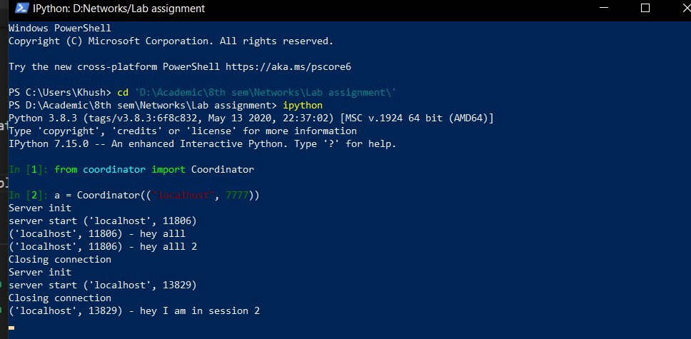

# Problem statement
Group chats where the group is contained in a chat server which is controlled by the chat coordinator.

Chat clients call the chat coordinator to make a new session or join a session.

Then clients can send and receive messages from the coordinator talking directly to it.

# To run
1. Run a coordinator by importing the Coordinator class and creating a coordinator object with localhost and 7777 port. use the follwing commands -
```
from coordinator import Coordinator
a = Coordinator(("localhost", 7777))
```


2. Now you can create multiple users, then use function create_session to register a new session with the coordinator. To join a session, use the join_session(session_name) function. To leave the session use leave_session() function. Once a session is joined into, you can use sen_message(your_message) to send the messaget to all persons connected to that session.

